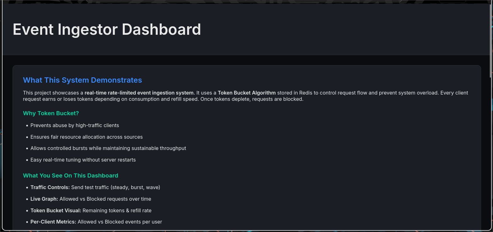
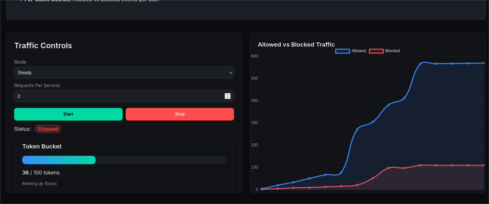
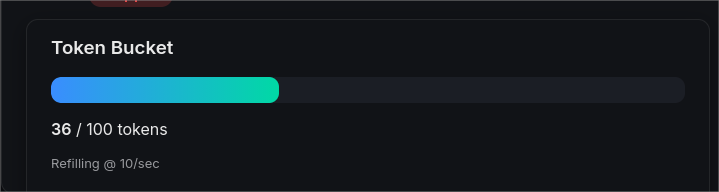
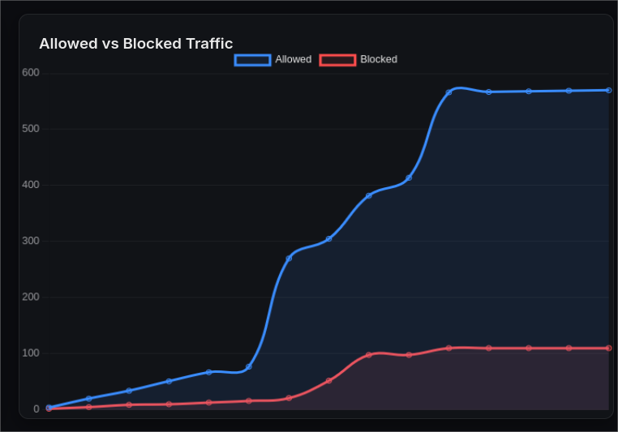

# 🚦 go-rate-limited-event-pipeline

High-performance event ingestion system with JWT auth, Redis-backed rate limiting, and real-time monitoring.



---

## 🚀 Overview

This project is a **production-grade event ingestion pipeline** built in Go, designed to handle high-volume traffic safely and predictably using a token bucket rate limiter in Redis.

### Key Components

| Component | Purpose |
|-----------|---------|
| **Go API Server** | Event ingestion, persistence, rate limiting, authentication |
| **PostgreSQL** | Event storage |
| **Redis** | Distributed token bucket for rate limiting |
| **JWT Authentication** | Secure client identity |
| **Real-Time Dashboard** | Observe requests, latency, blocking behavior, token bucket dynamics |

The system demonstrates how rate limiting protects downstream services while maintaining stable ingestion under load.

---

## 🧠 Core Concepts

### Why Rate Limiting?

Without rate limiting, a sudden spike in traffic (intentional or accidental) can:

- 💥 Crash your API
- 🔌 Exhaust database connections
- 🐌 Cause slowdowns or cascading failures
- 🎯 Open doors for abuse (DDoS, spam, script attacks)

This project implements a **Token Bucket algorithm** to avoid those failures.

### 🪣 Token Bucket Explained

The token bucket works like a wallet:

1. Every second, **N new tokens** are added
2. The bucket can hold up to **M tokens** total
3. Every request **"spends" a token**
4. If no tokens remain, the **request is blocked**


**Example:**
```
Capacity = 100 tokens
Refill Rate = 10 tokens/sec

Incoming Traffic = 50 req/sec
Effective Allowed = 10/sec (refill) + current bucket
Remaining requests are blocked
```

This creates **self-healing throttling** that automatically adjusts traffic without breaking clients.

---

## 🧱 Architecture

```
┌──────────┐        ┌──────────────┐        ┌────────────┐
│  Client  │── JWT ─▶│  Gin API     │──Event─▶│ PostgreSQL │
└──────────┘        │              │        └────────────┘
     ▲               │              │
     │               └──Limiter────▶│   Redis    │
     │                       ▲      └────────────┘
     └── Dashboard WS ◀──────┘
```

- **Redis** ensures all API instances share limiter state
- **PostgreSQL** stores validated events
- **WebSockets** push live metrics to UI


---

## ✨ Features

- ✅ JWT-based client identity
- ✅ Lua-backed Redis token bucket (fast, atomic)
- ✅ Live metrics via WebSocket
- ✅ Event storage in PostgreSQL
- ✅ Traffic simulator for load testing
- ✅ Dashboard with:
  - Requests/second graphs
  - Block rate vs. allowed rate
  - Token bucket visualization
  - Client leaderboard
  - Example traffic profiles (steady, burst, wave)

---

## 📦 Getting Started

### 1. Install Dependencies

**Arch Linux:**
```bash
sudo pacman -S go redis postgresql
```

**Ubuntu/Debian:**
```bash
sudo apt install golang redis-server postgresql
```

**macOS:**
```bash
brew install go redis postgresql
```

### 2. Clone and Setup

```bash
git clone https://github.com/yourusername/go-rate-limited-event-pipeline.git
cd go-rate-limited-event-pipeline
cp .env.example .env
```

Edit `.env` with your configuration.

### 3. Start Services

```bash
# Start Redis
redis-server &

# Setup PostgreSQL
sudo -iu postgres
psql -f scripts/setup_db.sql
```

### 4. Run the Server

```bash
go run cmd/server/main.go
```

The server will start on `http://localhost:8080`

---

## 🔑 Authentication

### Generate a JWT Token

```bash
curl -X POST http://localhost:8080/auth/login \
  -H "Content-Type: application/json" \
  -d '{"client_id":"test-123"}'
```

Save the returned token for API requests.

---

## 📩 Sending Events

```bash
TOKEN="paste_your_token_here"

curl -X POST http://localhost:8080/v1/events \
  -H "Authorization: Bearer $TOKEN" \
  -H "Content-Type: application/json" \
  -d '{
    "event_id": "abc-123",
    "source": "app",
    "payload": {"foo": "bar"}
  }'
```

**Response (Success):**
```json
{
  "status": "accepted",
  "event_id": "abc-123"
}
```

**Response (Rate Limited):**
```json
{
  "error": "rate limit exceeded",
  "retry_after": 5
}
```

---

## ⚙️ Runtime Configuration

### Update Rate Limiter Settings

```bash
curl -X POST http://localhost:8080/v1/config/limiter \
  -H "Content-Type: application/json" \
  -d '{
    "bucket": 200,
    "refill": 25
  }'
```

This updates the bucket capacity and refill rate without restarting the server.

---

## 📊 Dashboard

Access the real-time dashboard at:

```
http://localhost:8080/dashboard
```

### Dashboard Features



The dashboard shows:
- **Live request rate** (allowed vs blocked)
- **Token bucket levels** in real-time
- **Client leaderboard** (most active clients)
- **Latency percentiles** (p50, p95, p99)
- **Traffic pattern controls**



---

## 🧪 Traffic Simulation

Built-in traffic patterns for testing:

| Pattern | Behavior | Expected Graph Shape |
|---------|----------|---------------------|
| **steady** | Constant RPS | Flat upward slope → steady blocks |
| **burst** | Sudden spikes | Jagged sawtooth pattern |
| **wave** | Sinusoidal RPS | Wave-shaped throughput |

### Run Simulations

```bash
# Steady load: 30 req/sec for 60 seconds
./scripts/shell/steady_load.sh 30

# Burst test: sudden spike to 200 req/sec
./scripts/shell/burst_test.sh 200

# Wave pattern: oscillating load
./scripts/shell/wave.sh
```


---

## 🧠 Observing Limiter Behavior

During overload, expect to see:

1. ✅ **Allowed requests** slow and stabilize at refill rate
2. 🚫 **Blocked requests** climb proportionally
3. 📉 **Token bucket** empties to near zero
4. 📊 **Graph** shows throttle equilibrium



**This is what good protection looks like.**

---

## 🌪️ Real-World Use Cases

- 🛡️ Protecting microservices from bursty traffic
- 🚫 Preventing abuse from API clients
- 💰 Keeping cost of cloud DB under control
- ⚖️ Ensuring fair usage among tenants
- 🔥 Load shedding for stability

---

## 📁 Project Structure

```
├── cmd/
│   └── server/           # Application entrypoint
├── internal/
│   ├── api/              # Gin handlers + WebSocket
│   ├── auth/             # JWT auth & middleware
│   ├── limiter/          # Redis token bucket logic (Lua)
│   ├── metrics/          # Live metric aggregation
│   └── storage/          # Postgres event persistence
├── dashboard/            # Frontend UI
├── scripts/
│   ├── shell/            # Load testing scripts
│   └── setup_db.sql      # Database schema
├── docs/
│   └── images/           # Documentation images
├── .env.example          # Environment template
└── README.md
```

---

## 🧹 Debug & Reset

### Reset Database

```bash
./scripts/reset.sh
```

### Flush Redis Buckets

```bash
redis-cli FLUSHALL
```

### View Logs

```bash
tail -f logs/server.log
```

---

## 🏁 Roadmap

- [ ] Per-route rate limits
- [ ] Sliding window limiter option
- [ ] InfluxDB / Grafana export mode
- [ ] Kubernetes deployment manifests
- [ ] Multi-region Redis replication
- [ ] Metrics export to Prometheus

---

## 📄 License

MIT — Use freely, contribute when inspired.

---

## ❤️ Final Note

This system demonstrates a **real-world, defensive, and scalable approach** to API protection. If you understand this repo, you understand how to protect APIs from abuse.

### Contributing

Contributions are welcome! Please open an issue or submit a pull request.

### Support

⭐ Star this repo if you find it helpful!

---

**Built with ❤️ using Go, Redis, and PostgreSQL**
